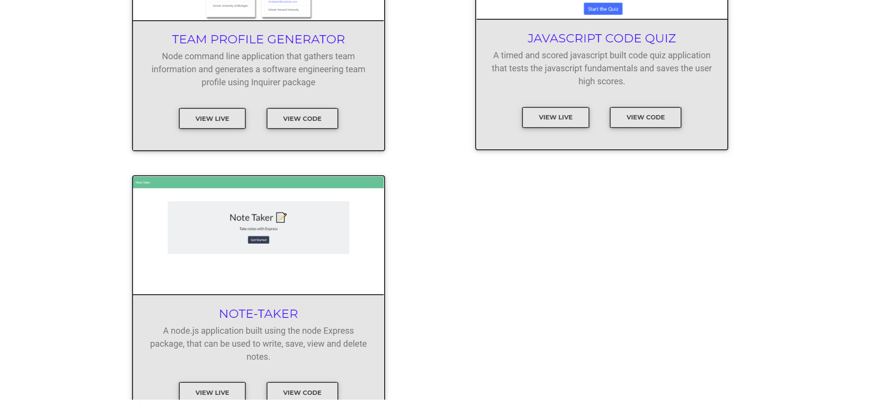

# updated_portfolio
Updated Portfolio

## User Story

```
AS A JOB SEEKER
I WANT to create my professional portfolio website,
SO THAT I can tell more about myself, provide contact details and showcase my work/projects to the recruiters/employers.

```

## Description

This is my portfolio website where you will find the following sections for quick and easy access to know me better professionally. Each of these sections will be regularly updated.

 - Portfolio section: This section lists the most recent projects that I've worked on. There is a brief description about what the project is all about along with the languages/technologies used for the project. Clicking on the image will give you access to a quick .gif demo of the application. For more details, you can use the "View Live" button to visit the deployed application or the "View Code" button to look at the code of the application within the github repository.

- About Me section : This section tells you more about myself, my background and what I currently do. It also briefly  states my soft skills and my hobbies. You can also download the latest copy of my resume using the "Download Resume" button.

 - Contact section: You can find the following details within this section:
    a. Address: You can click on the icon to view the location in google maps.
    b. Phone number : You can click on the icon to directly call me via your device(if available).
    c. Email address : You an click on the icon to send me a quick email.
    d. Github: You can click on the github icon to view my Github profile.
    e. LinkedIn: You can click on the linkedIn icon to connect with me via LinkedIn .
    f. Form to submit your contact details and leave a message that will allow for us to connect.


## Website Development
- The website runs in the browser and has a clean, polished and mobile-responsive user interface.
- The website is built using HTML, CSS and Javascript.
- The website uses the Bootstrap, MDBootstrap CSS framework for a few components as well as for quick styling.
- The website references Github, LinkedIn and Resume that is periodically updated. 
- References used: Lumia website template from www.free-css.com for Contact page.

## Technologies used
-  HTML, CSS, Bootstrap, MDBootstrap, Javascript

## License
This project is licensed under the terms of the MIT license.
[](https://opensource.org/licenses/MIT)

## Contributors
This website is individually developed by Jesal Mehta (Github profile- https://github.com/JesalDM/)

## For Review

* Deployed Application URL:  https://jesaldm.github.io/updated_portfolio/
* Github Repository URL: https://github.com/JesalDM/updated_portfolio
* Portfolio Website demo: 
* Screenshots : 
    - 
    - 
    - 
    - 
    - 
    - 